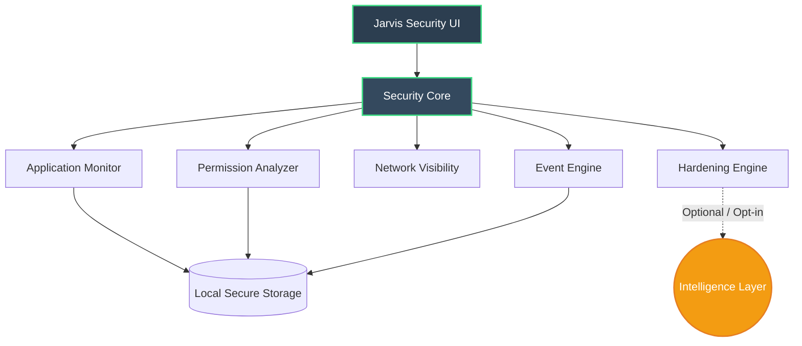

<div align="center">

  <!-- Optional: Place a local banner here for dynamic visual effect -->
  <!--  -->

  <h1>JARVIS SECURITY</h1>
  <h3>Android Security & Device Intelligence</h3>
  <p><em>Empowering Android users with transparent, no-root visibility into their device's security state.</em></p>

  <p>
    
    
    
    
    
    
  </p>

  <p>
    <a href="#overview">Overview</a> •
    <a href="#features">Features</a> •
    <a href="#architecture">Architecture</a> •
    <a href="#roadmap">Roadmap</a> •
    <a href="#installation">Installation</a> •
    <a href="#security">Security</a> •
    <a href="#contributing">Contributing</a>
  </p>

</div>

---

## Overview

**Jarvis Security** is an independent, privacy-first Android security project designed to provide users with actionable visibility into their device's security posture. 

Modern mobile operating systems abstract away critical security details, leaving users unaware of potential vulnerabilities, excessive permission grants, or anomalous application behavior. Jarvis Security bridges this gap by operating entirely within the boundaries of standard Android permissions—requiring **no root access**—to observe, analyze, and explain the security state of the device.

---

## Why Jarvis?

Android's security model is robust, but its transparency to the end-user is limited. Users are frequently prompted to grant permissions without understanding the implications, and background processes operate with minimal visibility. 

Jarvis Security is built to solve this opacity. It does not claim to be an antivirus that "blocks all malware" or a "complete firewall." Instead, it is a **security intelligence and visibility tool** that empowers users with factual, context-aware information about their device, enabling them to make informed hardening decisions.

---

## Core Philosophy

Jarvis Security operates on a strict, four-pillar methodology to ensure accuracy and prevent misleading claims:

1. **Observe**: Collect only what the Android framework explicitly exposes to non-root applications.
2. **Analyze**: Process observed data locally to identify misconfigurations, excessive permissions, or anomalous patterns.
3. **Explain**: Present findings in clear, human-readable language, distinguishing between facts and probabilities.
4. **Harden**: Provide actionable, step-by-step recommendations for users to improve their device security posture.

---

## Features

### Implemented / Core
- **Application Security Visibility**: Inspection of installed applications, target SDK versions, and declared permissions.
- **Permission Awareness**: Detailed breakdown of which apps hold sensitive permissions (e.g., Location, Microphone, Camera) and when they were last used (where Android permits).
- **Device Security Checks**: Verification of baseline security settings (e.g., screen lock status, unknown sources, encryption state).
- **Local Security Information**: On-device processing of security metrics with zero mandatory telemetry.

### Planned / Under Development
- **Security-Event Monitoring**: Localized logging of significant security-relevant events (e.g., new app installations, permission changes).
- **Network Visibility**: Basic network state awareness and DNS configuration checks (within standard Android API limits).
- **Device Hardening Recommendations**: Context-aware, step-by-step guides tailored to the user's specific device model and Android version.
- **Intelligence Layer**: Optional, opt-in AI-assisted reasoning to explain complex security findings (see [Intelligence Layer](#intelligence-layer)).

---

## Security Without Root

Jarvis Security is explicitly designed as a **no-root** platform. This imposes strict boundaries on what the application can and cannot do. To maintain absolute truthfulness, Jarvis categorizes all data into four distinct tiers:

| Data Tier | Description | Example |
| :--- | :--- | :--- |
| **OBSERVED** | Data directly exposed by Android APIs to standard apps. | List of installed packages, declared permissions, screen lock status. |
| **ANALYZED** | Conclusions drawn deterministically from observed data. | "App X requests background location but has no visible feature requiring it." |
| **INFERRED** | Probabilistic assessments based on patterns, clearly labeled as such. | "This app's behavior pattern is similar to known adware families." |
| **UNAVAILABLE** | Data protected by the OS, requiring root or system privileges. | Kernel-level process monitoring, raw network packet inspection, other apps' private data. |

*Jarvis will never claim to access UNAVAILABLE data.*

---

## Privacy

Privacy is the foundation of Jarvis Security.
- **Local-First Design**: All core analysis, permission checking, and security scoring are performed entirely on the device.
- **Minimal Data Collection**: No personal data, usage statistics, or device identifiers are collected by default.
- **Optional External Services**: Any feature requiring external connectivity (e.g., fetching updated threat intelligence signatures or the optional Intelligence Layer) will be strictly opt-in, transparent, and documented.

---

## Intelligence Layer

*Status: Planned / Under Development*

The Intelligence Layer is an optional, modular component designed to enhance the explainability of security findings. It is **not** an autonomous "AI threat detector." Instead, it is intended to:
- Translate complex Android security logs into plain language.
- Provide contextual risk assessments based on aggregated, anonymized, and privacy-preserving threat models.
- Operate with strict user consent, with the ability to run entirely offline using lightweight, on-device models where feasible.

---

## Architecture

Jarvis Security follows a modular, layered architecture to ensure maintainability, testability, and strict separation of concerns.



<details>
<summary><strong>View Component Descriptions</strong></summary>
<br>
<ul>
  <li><strong>Security Core:</strong> Central orchestrator managing data flow and module lifecycle.</li>
  <li><strong>Application Monitor:</strong> Interfaces with PackageManager to assess app metadata and risk indicators.</li>
  <li><strong>Permission Analyzer:</strong> Maps declared and runtime permissions against user-defined security policies.</li>
  <li><strong>Network Visibility:</strong> Checks accessible network configurations (e.g., Private DNS status) without packet sniffing.</li>
  <li><strong>Event Engine:</strong> Listens to permitted system broadcasts (e.g., PACKAGE_ADDED) for local audit logging.</li>
  <li><strong>Hardening Engine:</strong> Generates actionable recommendations based on analyzed device state.</li>
  <li><strong>Intelligence Layer:</strong> Optional module for advanced, explainable security reasoning.</li>
</ul>
</details>

---

## Project Structure

```text
jarvis-security/
├── app/
│   ├── src/main/
│   │   ├── java/com/omniintell/jarvis/
│   │   │   ├── core/          # Central orchestration & business logic
│   │   │   ├── monitor/       # Application & permission monitoring
│   │   │   ├── engine/        # Event & hardening recommendation engines
│   │   │   ├── ui/            # Jetpack Compose / XML views
│   │   │   └── data/          # Local storage & repository patterns
│   │   ├── res/               # Resources (drawables, strings, themes)
│   │   └── AndroidManifest.xml
│   └── build.gradle.kts
├── assets/                    # Optional local visual assets (e.g., jarvis-banner.gif)
├── docs/                      # Extended technical documentation
├── SECURITY.md                # Vulnerability disclosure policy
├── LICENSE                    # License file (TBD)
└── README.md
```

---

## Android Compatibility

- **Target Range**: Android 9 (API 28) to Android 16 (API 36).
- **Variability**: Functionality may vary significantly depending on the Android version and device manufacturer (OEM). For example, background process visibility and certain permission usage stats are more restricted in Android 11+ compared to Android 9. Jarvis gracefully degrades features and clearly labels when specific data is unavailable due to OS-level restrictions.

---

## Roadmap

### Current / Completed
- [x] Initial project scaffolding and architecture design
- [x] Core Application Monitor (package inspection)
- [x] Basic Permission Analyzer
- [x] Privacy-first local data handling implementation

### Planned / In Progress
- [ ] Event Engine for local security audit logging
- [ ] Device Hardening recommendation engine
- [ ] Network configuration visibility checks
- [ ] Optional Intelligence Layer (offline-first design)
- [ ] Comprehensive UI/UX polish for dark-tech aesthetic

---

## Installation

> **Note:** Jarvis Security is currently under active development. Pre-compiled release APKs are not yet available. 

When releases are available, installation instructions will be provided here. For now, developers can build the project locally:

1. Clone the repository:
   ```bash
   git clone https://github.com/omniintell/jarvis-security.git
   ```
2. Open the project in **Android Studio**.
3. Sync the project with Gradle files.
4. Build and run the `app` module on a physical device or emulator running Android 9+.

---

## Development

This project is built using modern Android development practices:
- **Language**: Kotlin
- **IDE**: Android Studio
- **UI**: Jetpack Compose (planned/primary)
- **Architecture**: MVVM with Clean Architecture principles
- **Concurrency**: Kotlin Coroutines and Flow

Contributors are expected to follow standard Kotlin coding conventions and write meaningful commit messages.

---

## Security

We take the security of Jarvis Security seriously. If you discover a vulnerability within the application or its infrastructure, please do not open a public issue.

Refer to our [Security Policy](SECURITY.md) for instructions on responsible vulnerability disclosure. We are committed to acknowledging and addressing valid reports promptly.

---

## Contributing

Contributions are welcome and appreciated. To ensure a smooth process:
1. **Fork** the repository.
2. **Create a Feature Branch** (`git checkout -b feature/AmazingFeature`).
3. **Commit your changes** (`git commit -m 'Add some AmazingFeature'`).
4. **Push to the Branch** (`git push origin feature/AmazingFeature`).
5. **Open a Pull Request** detailing the changes, the problem solved, and any testing performed.

Please ensure your code adheres to the project's architecture and does not introduce unnecessary permissions or external dependencies without prior discussion.

---

## License

**License: To be determined.**  
The final open-source license (e.g., MIT, Apache 2.0, or GPL v3) will be selected and added to this repository prior to the first stable public release. All rights are currently reserved by the project founder.

---

## OmniIntell

Jarvis Security is developed under the OmniIntell brand ecosystem:

- **OmniIntell Technologies**: Parent venture.
- **OmniIntell Labs**: Research and development organization.
- **OmniIntell**: Core brand identity.
- **Jarvis Security**: Flagship no-root Android security project.

*Note: OmniIntell Technologies is an independent development venture. Claims of formal corporate incorporation should not be assumed unless explicitly documented in official legal filings.*

---

## Founder

**Omkareshwar Sinha**  
*Founder — OmniIntell*

---

## Disclaimer

Jarvis Security is provided "as is" without warranty of any kind, express or implied. It is designed to improve security visibility and awareness, not to guarantee absolute device security. 

- Jarvis Security **cannot** and **does not** detect every threat, block all malware, or replace the need for cautious user behavior.
- The absence of warnings does not guarantee that a device is completely secure.
- Users are responsible for their own device configurations and the applications they choose to install.
- This tool operates within the strict limitations of the Android OS without root privileges.
